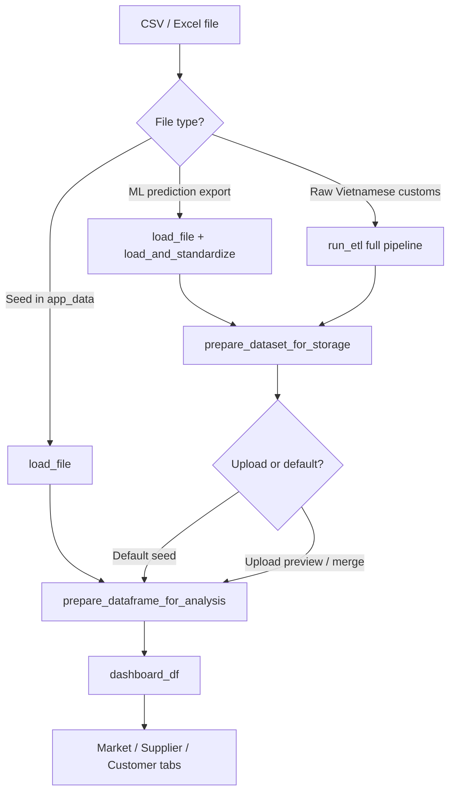

# MDI Data Analysis

Standalone **Streamlit** app for Vietnam chemical import analytics — **MDI** and **TDI** product lines, standardized data ingest, optional merge, and **Market / Supplier / Customer** dashboards.

## Quick start

**Windows**

```bat
run_app.bat
```

**Manual**

```bash
python -m venv .venv
.venv\Scripts\activate          # Windows
# source .venv/bin/activate     # macOS / Linux
pip install -r requirements.txt
streamlit run app.py
```

Open **http://localhost:8501**.

---

## What the app does

| Tab | Name | Purpose |
|-----|------|---------|
| **1** | Market overview | Yearly volume, market share, monthly trends, top customers/suppliers |
| **2** | Supplier overview | Supplier volume by period, direct/indirect sales, customer mix |
| **3** | Customer overview | Customer search, period comparison, supplier mix |

Both **Use default file** and **Upload new file** run the **same dashboard logic** on `dashboard_df`. Only the **row set** and **data source label** change.

---

## Data paths at a glance

```text
┌─────────────────────────────────────────────────────────────────────────────┐
│                         STREAMLIT APP (app.py)                              │
│  apply_data_source_selection() → dashboard_df → Tab 1 / 2 / 3 charts        │
└─────────────────────────────────────────────────────────────────────────────┘
         ▲                                    ▲
         │                                    │
   Use default file                    Upload new file
         │                                    │
         ▼                                    ▼
  app_data/*.csv                    ML prediction CSV
  (seed, pre-built)                 (e.g. predictions_pmdi_etl.csv)
         │                                    │
         │ load_seed_dataset_for_analysis     │ ingest_upload_file()
         │                                    │
         └──────────────┬─────────────────────┘
                        ▼
              prepare_dataframe_for_analysis()
              (in-memory enrichment + chart columns)
                        ▼
                   dashboard_df  (~34 columns)
```

| Folder | Role |
|--------|------|
| `app_data/` | Default MDI/TDI seed CSVs (dashboard **Use default file**) |
| `data/` | Optional working copies / sample prediction files |
| `app_config/` | `customer_list.csv` — short-name mapping |
| `temp/` | Staging for sidebar uploads (`_preview_*`, `_upload_*`) |
| `config/settings.py` | HS codes, saler rules, supplier lists, sale-channel rules |

---

## End-to-end pipeline overview

Processing has **three layers**. Same layer names apply to default and upload; only layer **1** differs.

| Layer | Name | Where | Persists to disk? |
|-------|------|-------|-------------------|
| **1** | **Ingest / load** | `load_file`, `load_and_standardize`, or `run_etl` | Upload merge writes CSV |
| **2** | **Storage prep** | `prepare_dataset_for_storage()` | Yes (merge / download) |
| **3** | **Analysis prep** | `prepare_dataframe_for_analysis()` | No — `dashboard_df` in session only |



---

## Path A — Use default file

**Trigger:** Sidebar → **Dataset & data source** → **Use default file**  
**Source files:**

- MDI → `app_data/final_pmdi_2022_2025_30_may.csv`
- TDI → `app_data/final_tdi_2022_2025_27_May.csv`

**Code entry:** `ui/analysis_data.py` → `load_default_data()` → `load_seed_dataset_for_analysis()`

### Step-by-step (default file)

| Step | Action | Module / function | Detail |
|------|--------|-------------------|--------|
| **A1** | Resolve path | `services/data_paths.py` → `default_dashboard_dataset_path()` | Always reads **`app_data/`** seed for dashboards |
| **A2** | Load CSV | `services/data_loader_service.py` → `load_file()` | Read CSV/Excel; trim headers; `normalize_ml_column_names()` |
| **A3** | Skip heavy ETL | — | Seed is **already standardized** (English columns, kg, ML columns). **No** `OrderDataPipeline` on disk file |
| **A4** | Customer short names | `services/customer_name_service.py` → `apply_customer_short_names()` | Map `customer_id` / name via `app_config/customer_list.csv` (in memory only) |
| **A5** | Saler standardization | `services/saler_name_service.py` → `apply_saler_name_standardization()` | Rules in `config/settings.py` (`SALER_NAME_*`) |
| **A6** | Direct / indirect | `services/type_sale_service.py` → `apply_type_sale_column()` | Column `type_sale` = DIRECT / INDIRECT from saler vs supplier |
| **A7** | Analysis frame | `services/analysis_service.py` → `prepare_analysis_frame()` | See [Analysis frame columns](#analysis-frame-columns-layer-3) |
| **A8** | Volume in tons | `ui/analysis_data.py` → `add_volume_ton()` | `volume_ton = volume / 1000` |
| **A9** | Session + filters | `finish_dashboard_load()` | Sets `dashboard_df`; syncs sidebar sale channel, year, supplier, customer |

**Important:** The seed file on disk is **never modified** by dashboard load. Enrichment in steps A4–A8 runs **in memory** each session.

---

## Path B — Upload new file

**Trigger:** Sidebar → **Upload new file** → choose CSV/Excel  
**Expected format:** **ML prediction export** — same schema as `data/predictions_pmdi_etl.csv` (standardized English columns + ML targets).

**Code entry:** `services/upload_ingest_service.py` → `ingest_upload_file()`  
**Preview / dashboard:** `ui/upload_preview_panel.py` → `ensure_upload_preview_dashboard()`

### Required upload schema (minimum)

The file must pass `is_standardized_dataset()` — at least **3 of 4** markers:

- `hs_code`
- `description`
- `customer_id`
- `total_usd`

Plus non-empty values for analytics:

- **BRAND NAME**, **SUPPLIER**, **TYPE**

Optional but typical on prediction exports:

- `marked_for_delete`, `delete_reason` (confidence columns stripped on ingest)
- `Sale_chanel`, `month`, `quarter`, `unit`, `volume`, `saler`, …

Raw Vietnamese-only customs files are **not** accepted by sidebar upload (use external ML Predict pipeline first).

### Step-by-step (upload file)

| Step | Action | Module / function | Detail |
|------|--------|-------------------|--------|
| **B1** | Save to temp | `services/data_paths.py` → `temp_file_path("preview" \| "upload", …)` | Under `temp/` |
| **B2** | Validate format | `upload_ingest_service.classify_upload_format()` | Must be **ML prediction export** |
| **B3** | Dataset match | `services/upload_dataset_validation.py` | Filename / HS must match MDI vs TDI selection |
| **B4** | Load file | `load_file()` | Headers normalized; ML column aliases renamed |
| **B5** | Unit filter | `load_and_standardize(unit_filter="kg")` | Keep **`unit == kg`** rows only |
| **B6** | Sale channel | `add_sale_channel_column()` | Indent / Local — see [Sale channel rules](#sale-channel-indent--local) |
| **B7** | Customer short names | `apply_customer_short_names()` | Same as default path |
| **B8** | Saler standardization | `apply_saler_name_standardization()` | Same as default path |
| **B9** | type_sale | `apply_type_sale_column()` | DIRECT / INDIRECT |
| **B10** | Row filter | `prepare_dataset_for_storage()` | Drop `marked_for_delete = Yes`; drop unknown-brand rows; strip predict-only columns |
| **B11** | Column cleanup | `drop_upload_noise_columns()` | Remove `UNWANTED_COLS` + empty columns from `settings.py` |
| **B12** | Analysis prep | `prepare_dataframe_for_analysis()` | Same layer 3 as default → `dashboard_df` |
| **B13** | Sidebar preview | `render_upload_preview_panel()` | Collapsible summary; dry-run merge stats |
| **B14** | Optional merge | **Update data** button | Append new months into seed dataset — see [Merge](#merge-update-data) |

### Upload UX flow

1. Select **Upload new file** and pick CSV/Excel.
2. Sidebar shows collapsible **Upload · Ready · N rows · period** (expand for details).
3. Dashboards immediately show **upload rows only** (no merge yet).
4. **Download processed file** — same rows as would be merged (post step B10).
5. Click **Update data** to append into the saved dataset (new months only).

---

## Layer 1 detail — Full ETL (raw customs only)

Used when `load_and_standardize(force_etl=True)` or `is_raw_customs_export()` detects Vietnamese headers (`hs code`, `chung loai hang hoa xuat nhap`, …).

**Not used** for current sidebar upload (prediction export only). Documented for completeness / CLI-style use.

**Entry:** `services/etl_service.py` → `run_etl()`  
**Pipeline:** `services/data_process.py` → `OrderDataPipeline.run()`

| Order | Step | Description |
|-------|------|-------------|
| 1 | Load | CSV or Excel |
| 2 | Clean headers | Lowercase column names |
| 3 | Sale channel (raw) | `add_sale_channel_column()` on Vietnamese transport column |
| 4 | Drop noise cols | `UNWANTED_COLS` from settings |
| 5 | Text normalize | Lowercase text fields; HS code trim |
| 6 | Numeric parse | `volume`, prices, `total_usd`, tax |
| 7 | Dates | `month`, `quarter` from `ngay` |
| 8 | Missing USD | Drop rows without `tri gia usd` |
| 9 | Units | Keep kg / tấn / Thùng; convert **tấn → kg** (volume × 1000, price ÷ 1000) |
| 10 | USD pricing | Standardize non-USD rows to USD unit price |
| 11 | HS filter | Keep MDI or TDI HS code list |
| 12 | Rename | `COLUMN_RENAME_MAP` → English names |
| 13 | Enrich | Sale channel, customer, saler, `type_sale` (same as upload steps B6–B9) |
| 14 | Unit filter | Keep `unit == kg` if requested |

---

## Layer 2 — Storage prep (`prepare_dataset_for_storage`)

**File:** `services/ml_columns.py`

| Order | Rule | Effect |
|-------|------|--------|
| 1 | `marked_for_delete == Yes` | Row removed (from ML Predict export) |
| 2 | Unknown brand | Remove rows where BRAND NAME is UNKNOW and TYPE empty |
| 3 | Drop predict columns | `delete_reason`, confidence columns, `_predict_row_id`, `_preserve__*` |
| 4 | Drop derived | `supplier_raw`, `material_type`, `volume_ton`, … (rebuilt on load) |
| 5 | Drop unwanted / empty | `UNWANTED_COLS` + all-empty columns |

**Output:** ~26 core columns suitable to save or merge.

---

## Layer 3 — Analysis prep (`prepare_dataframe_for_analysis`)

**File:** `ui/analysis_data.py` + `services/analysis_service.py`

Runs on **every** dashboard load (default and upload):

| Order | Step | Columns added / updated |
|-------|------|-------------------------|
| 1 | Customer short names | `customer_name` (display) |
| 2 | Saler rules | `saler` (canonical) |
| 3 | type_sale | `type_sale` |
| 4 | ML normalize | Column name aliases |
| 5 | Sale channel | `Sale_chanel` (recalc if transport present; else keep existing) |
| 6 | Numeric types | `volume`, `total_usd`, `year`, `date` |
| 7 | Time fields | Fill missing `month` / `quarter` from `date` |
| 8 | Supplier derivations | `supplier_raw`, `supplier_group` |
| 9 | Material type | `type_clean`, `material_type`, `material` |
| 10 | Sort keys | `month_num`, `quarter_num` |
| 11 | volume_ton | `volume / 1000` |

### Analysis frame columns (layer 3)

Typical `dashboard_df` has **~34 columns**, including:

`year`, `date`, `month`, `quarter`, `customer_id`, `customer_name`, `hs_code`, `description`, `saler`, `volume`, `volume_ton`, `total_usd`, `unit`, `Sale_chanel`, `type_sale`, `BRAND NAME`, `SUPPLIER`, `TYPE`, `supplier_raw`, `supplier_group`, `type_clean`, `material_type`, `material`, …

Charts and sidebar filters read from this frame only.

---

## Sale channel (Indent / Local)

**File:** `services/sale_channel_service.py`  
**Config:** `config/settings.py` → `INDENT_TRANSPORT_LABELS`, `SALE_CHANNEL_*`

| Value | Rule |
|-------|------|
| **Indent** | `phuong tien van tai` matches sea transport labels **and** currency is **not** VND |
| **Local** | Transport does not match indent list **or** currency is VND |

Sea transport labels (examples):

- `Đường biển`
- `Đường biển (container)`
- `Đường biển (hàng rời, lỏng...)`

**Upload note:** After ingest, `phuong tien van tai` is dropped (unwanted column). If kept rows already have `Sale_chanel` in the file, that value is preserved. Rows removed by `marked_for_delete` may have been Indent in the raw export — check `delete_reason` in the ML CSV if Indent counts are zero after upload.

---

## Saler name standardization

**File:** `services/saler_name_service.py`  
**Config:** `config/settings.py` → `SALER_NAME_*`

Pipeline per `saler` cell:

1. Lowercase + fold accents  
2. Remove `(…)` blocks containing MST keyword  
3. Strip legal suffixes (`LIMITED`, `CO LTD`, `TNHH`, …)  
4. Strip punctuation from `SALER_NAME_STRIP_CHARACTERS`  
5. Optional regex / exact maps (`SALER_NAME_MAP`, e.g. Covestro Hong Kong variants)  
6. Uppercase output  

Applied on **every load** in memory (Tab 2 supplier / saler charts use this column).

---

## type_sale (Direct / Indirect)

**File:** `services/type_sale_service.py`

- **DIRECT** — saler name matches the row’s **SUPPLIER** (after saler normalization)  
- **INDIRECT** — otherwise  

Used on Tab 2 supplier charts when **Type of sale** filter is enabled.

---

## Merge (Update data)

**Trigger:** Sidebar → **Update data** (after successful upload preview)

| Step | Action |
|------|--------|
| 1 | Re-run `ingest_upload_file()` on uploaded bytes |
| 2 | Load current seed via `load_storage_dataset()` |
| 3 | **Block** if upload month already exists in base data |
| 4 | `append_only_new_rows()` — month-based append |
| 5 | Save via `prepare_dataset_for_storage()` → `app_data/final_pmdi_….csv` or TDI equivalent |
| 6 | Reload `dashboard_df` from merged result |

Merge requires **BRAND NAME**, **SUPPLIER**, **TYPE** on incoming rows.

---

## Required columns for analytics

Column **names** matter; **position does not**.

| Column | Purpose |
|--------|---------|
| **BRAND NAME** | Product / brand label (ML) |
| **SUPPLIER** | Producer group (ML) |
| **TYPE** | Material type PMDI / MMDI / … (ML) |
| `volume` | Quantity (kg after ingest) |
| `year` / `date` / `month` | Time filters and charts |
| `Sale_chanel` | Indent / Local filter |
| `customer_id` / `customer_name` | Tab 3 customer views |

If ML columns are missing, prepare data in the external **Train & Predict** tool, export CSV, then upload here.

---

## Repository layout

```text
TRAIN_CUSTOM_MODEL/
├── app.py                      # Streamlit entry
├── run_app.bat
├── requirements.txt
├── config/
│   └── settings.py             # HS codes, saler rules, supplier lists, paths
├── services/
│   ├── data_loader_service.py  # load_file, load_and_standardize
│   ├── upload_ingest_service.py# Sidebar upload ingest
│   ├── etl_service.py          # Full raw ETL (run_etl)
│   ├── data_process.py         # OrderDataPipeline (raw customs)
│   ├── ml_columns.py           # Storage prep, ML column gates
│   ├── sale_channel_service.py
│   ├── saler_name_service.py
│   ├── customer_name_service.py
│   ├── type_sale_service.py
│   └── analysis_service.py     # prepare_analysis_frame
├── ui/
│   ├── analysis_data.py        # dashboard_df load / merge
│   ├── upload_preview_panel.py # Sidebar upload summary
│   ├── dashboard_market.py     # Tab 1
│   ├── dashboard_supplier.py   # Tab 2
│   └── dashboard_customer.py   # Tab 3
├── app_data/                   # Default seed CSVs
├── data/                       # Sample / working files
├── app_config/
│   └── customer_list.csv
└── temp/                       # Upload staging
```

---

## Configuration reference

| Setting | Location | Purpose |
|---------|----------|---------|
| MDI / TDI HS codes | `settings.py` | Product-line filters |
| `COLUMN_RENAME_MAP` | `settings.py` | Vietnamese → English (full ETL) |
| `UNWANTED_COLS` | `settings.py` | Dropped on storage / raw ETL |
| `SALER_NAME_*` | `settings.py` | Saler normalization |
| `INDENT_TRANSPORT_LABELS` | `settings.py` | Sale channel Indent |
| Supplier / customer lists | `settings.py` | Tab 1–3 filter options |
| Customer short names | `app_config/customer_list.csv` | Display names |

---

## Key code entry points

| User action | Function |
|-------------|----------|
| App start, default load | `apply_data_source_selection()` → `load_default_data()` |
| Upload preview / dashboard | `ensure_upload_preview_dashboard()` → `load_upload_for_dashboard()` |
| Merge upload | `apply_data_source_selection()` (merge branch) → `ingest_upload_file()` |
| Render charts | `render_analysis_page()` → Tab 1/2/3 with `get_dataframe()` |

---

## Requirements

- Python **3.10+** (3.12 recommended)  
- `requirements.txt`: streamlit, pandas, numpy, plotly, openpyxl  

---

## License

Internal / project use.
